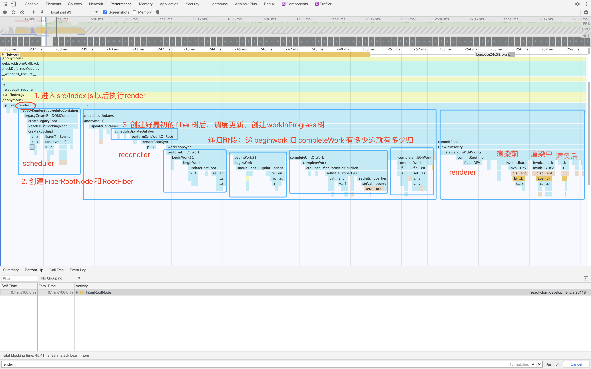

## React架构篇1：React的工作流程 和 对JSX的理解

### React在浏览器中的工作流程

1. 启动项目后，浏览器执行到`src/index.js`的时候:

   ```jsx
   // src/index.js
   import React from 'react';
   import ReactDOM from 'react-dom';
   import './index.css';
   import App from './App';
   import reportWebVitals from './reportWebVitals';
   
   ReactDOM.render(   // 调用render
     <React.StrictMode>
       <App />
     </React.StrictMode>,
     document.getElementById('root')
   );
   ```

2. 按照理念篇：React首先创建fiber树，然后进行React三大步：scheduler ->reconciler->renderer

   


### 深入JSX

1. JSX是什么？

   JSX是React对JS的一种（结合了类XML语法）的扩展，通过`babel`进行编译成目标版本JS代码。理解JSX，像理解"这段代码是用java写的"这句话一样，来理解"这段代码是用JSX写的"。

2. JSX 与Fiber之间的关系
   
   JSX 是一种语法格式，从Fiber的3层含义里面可以知道：

   1. 从Fiber的静态数据结构方面理解：用JSX写的代码经过`babel`编译以后，按照JSX的层级逻辑生成了fiber节点中标签相关的信息，fiber节点组成了fiber树。
   2. 从Fiber的动态工作单元来说，JSX的代码经过编译的过程，react会结合代码逻辑生成对应的fiber节点。
   3. 从架构上来说，他们没有太大关系：JSX这个时候只是语法糖，Fiber是异步可中断更新的架构（意思就是你换个语言写Fiber也是可以的）

3. ReactComponent 和 ReactElement 是什么关系

   1. ReactComponent是什么：react组件，对于ClassComponent来说，就是ClassComponent这个类本身；对于FunctionComponent来说，就是FunctionComponent本身。对于hostComponent来说就是标签本身
   2. ReactElement是什么：react组件在调用React.createElement()后生成的一个实例。

   可以简单的理解为：ReactElement是ReactComponent在react运行这个组件的时候，通过React.createElement()产生的一个组件实例，

   ```jsx
   // 组件A
   function A(){
   	return <div>A</div>
   }
   // 组件B
   function B(){
     // <A /> 这种语法需要这样理解：组件A的一个实例
   	return <A />
   }
   ```

4. 源码解读

   1. babel对JSX的编译  
   
      JSX

      ```jsx
         class A extends React.Component {
            render(){
               return 'A'
            }
         }
         function B(){
            return <A />
         }
      ```
      经过`babel`编译后的代码
      ```js
      // class 编译成ES2015 
      var A = /*#__PURE__*/function (_React$Component) {
         _inherits(A, _React$Component);
         
         var _super = _createSuper(A);

         function A() {
            _classCallCheck(this, A);

            return _super.apply(this, arguments);
         }

         _createClass(A, [{
            key: "render",
            value: function render() {
               return 'A';
            }
         }]);

         return A;
      }(React.Component);

      // B 本身就是个函数
      function B() {
         // <A />就是 React.createElement(A, null)返回结果，注意第一个参数是A本身，即class本身
         return /*#__PURE__*/React.createElement(A, null);
      }
      ```

   2. React源码（见react源码文件：`react/packages/react/src/ReactElement.js`）
