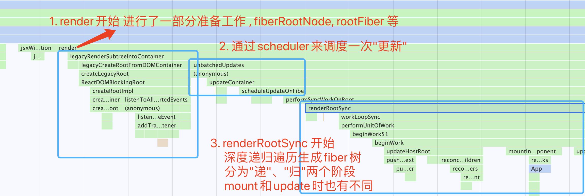

## React的Render阶段

### React的render整体流程

1. 从最开始的性能图可以知道，`render`阶段最开始是创建吃初始化的fiber树，只有两个节点`FiberRootNode -> RootFiber`

2. 然后通过`scheduler`调度一次更新（`scheduleUpdateOnFiber`），启动`renderRootSync`进行深度递归遍历的工作

3. 深度遍历递归完成后，生成`fiber树`，进入到`commit`阶段

    运行时的时序性能图：
    

### React "递归"阶段的流程分析

1. 递归阶段：`beginWork`代表递阶段，`completeWork`代表归阶段；见源码`react/packages/react-reconciler/src/ReactFiberBeginWork.old.js`

2. 深度优先遍历（DFS）：先遍历子节点，然后再遍历兄弟节点，最后返回；如果遍历子节点的时候发现子节点还有子节点，则进行递归遍历完子节点子树。

3. `Render`阶段对DFS的应用

    (:warning:需要调试)

    示例代码：
    ```jsx
        function A(){
            return (
                <div>
                    <p>This is a <span>a text code</span></p>
                    <a>is</a>
                </div>
            )
        }
    ```

    解释：
    1. 首先进度`div`的`beginWork`，进入以后，发现有子节点，进行深度遍历，遍历第一个子节点`p`
    2. 进度`p`的`beginWork`，首先是文本节点'This is a'，然后是`span`节点；同理，进行文本节点的`beginWork`
    3. 文本节点没有子节点，也没有兄弟节点，进入`completeWork`
    4. 文本节点`completeWork`以后，进行遍历它的兄弟节点`span`，`span`节点进入`beginWork`
    5. `span`节点进行`completeWork`，发现没有兄弟节点，返回进行`p`的`completeWork`（react对这种里面**只**是文本的节点进行了优化，不再对里面的文本进行`beginWork`和`compelete`）
    6. `p`进行`completeWork`后，遍历`p`的兄弟节点`a`
    7. `a`进入`beginWork`，然后`completeWork`，发现没有兄弟节点以后返回进行`div`的`completeWork`
    8. `div`完成`beginWork`到`completeWork`的过程，`Render`阶段结束。
    
4. `performUnitOfWork`就是对一个fiber节点执行一次完整的递归阶段，伪代码

    ```javascript
    function performUnitOfWork(current, workInProgress){
    	// step1 执行beginWork
      beginWork(current, workInProgress)
      // step2 检查是否有子节点
      if(workInProgress.child){
        performUnitOfWork(workInProgress.child)
    	}
      // step3 子节点完成递归阶段后，当前节点进行归阶段
      completeWork(workInProgress)
      // step4 当前节点完成归阶段后，检查是否还有兄弟节点
      if(workInProgerss.sibling){
        performUnitOfWork(workInProgress.sibling)
      }
    }
    ```

    

#### React的mount和update对深度优先遍历的影响

在`React`的`mount`阶段和`update`阶段，由于双缓存，`mount`和`update`的两颗树是不一样，因此`beginWork`和`completeWork`也是分为`mount`和`update`。

