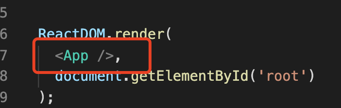

#### mount 时候的 beginWork

mount 的时候，react 只建立了一颗`FiberRootNode`->`rootFiber`A 树，然后就进入第一次`beginWork`

1. 进入第一次`beiginWork`，此时`beginWork`参数中的`current`代表 A 树中的`rootFiber`，`workInProgress`树代表 B 树中的`rootFiber`。

2. 进入第二次`beginWork`，此时 A 树中已经没有节点，`current`则为 null，`workInProgress`树会去生成子节点，即我们的`App`。

   

3.
