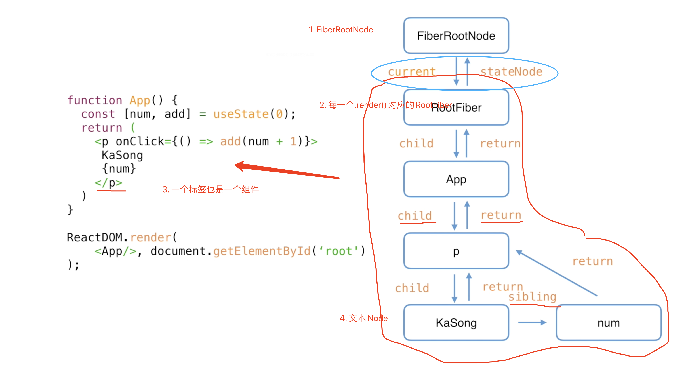
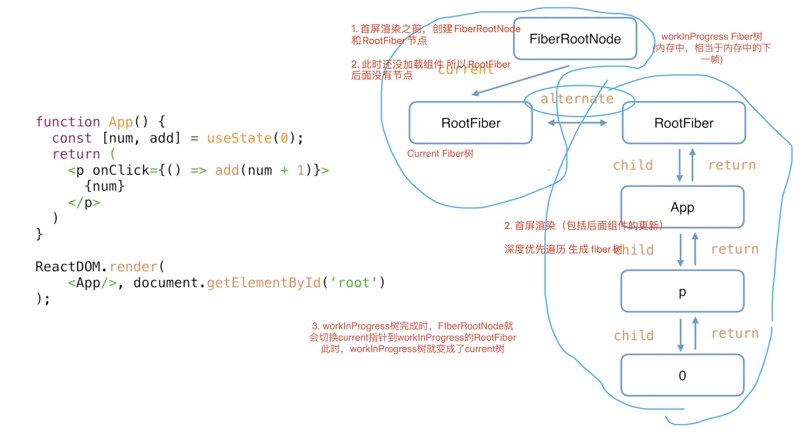

## React 理念篇

### React设计理念

1. **设计理念：** **快速响应**
2. **什么因素制约快速响应：** 计算能力和网络延迟，分别表现在**CPU瓶颈**和**IO瓶颈**
3. **CPU瓶颈：**
   1. 现代浏览器工作原理：主流浏览器60帧，一帧16.6ms，进行` css tree + js tree -> 渲染 `的工作
   2. js计算后，浏览器生成页面布局（render tree），然后再进行渲染。
   3. js计算过大的时候导致计算时间超过16.6ms（不一定是16.6ms，因为这时间还包括生成渲染树和进行渲染的时间；一帧的时间可能会超过或者低于16.6ms，取决于frame task）
   4. 超过一帧时间，计算继续进行，导致没有时间进行渲染相关工作。页面出现`卡死`
4. **IO瓶颈：** 网络延迟，这一般解决办法加`loading`显示，让用户明显感觉到等待
5. **React老架构的问题：只能同步更新**
   1. 当计算量大的时候，递归更新，会造成掉帧卡死
6. **React新架构给出的解决办法：异步可中断更新**
   1. 对于CPU瓶颈：架构改造，采用`Fiber`架构
   2. 对于IO瓶颈：将人工交互的研究成果融入到UI显示，即`Concurret`模式：请求数据的时候，先停留一段时间，如果请求数据的时间短暂，不显示过渡动画（`loading`）；如果时间长（或者说是超过了某一段时间），再展示过渡动画。


### React架构演进史

#### 老的架构（React 15）：reconciler + renderer  - 同步递归更新

1. 老的架构只有`reconciler(协调器，负责diff)`和`render(渲染器，负责渲染到对应的agent)`
2. `react`发生更新后，`reconciler`和`render`是同步进行的（一次更新只会进行一次diff，但是界面上的一个动作，比如打开modal，react可能会认为是多个动作），且这个过程不可终端（即diff过程不可终端）。
3. reconciler在进行diff的过程中，一旦发现某个state更新了，就会通知render去渲染，渲染完成后再进行后面的diff过程，去发现另外需要更新state，然后再去通知render进行更新，如此循环直到diff结束，即递归更新（源码里的`mountComponent`和`updateComponent`相关）。
4. [filer的介绍中有提到react15的diff](https://www.youtube.com/watch?v=ZCuYPiUIONs&t=801s)

#### 老的架构为什么不能异步可中断更新

1. react15架构中，在处理`一个动作触发多次更新`的情况的时候，是同步进行的，如果在某一次更新（某一次diff）进行中断，则后面的更新不能够进行（因为react15不支持异步，所以中断后是不能重新启动的），所以设计成成recocile过程不能够中断， 界面只能重新渲染一部分，在用户看来就是bug。
2. 第一条的解释只解释了react15是`同步更新`，用来解释为什么不支持异步更新很牵强，好比`因为它不支持中异步所以不能异步可中断更新`，老的架构为什么不能支持异步可中断更新：因为它就没设计。

#### 新的架构（React16）：scheduler + reconciler + renderer - 异步可中断更新

1. scheduler：调度器，决定更新的优先级，当有优先级更高的更新，则reconciler会停止当前的协调过程，即reconciler的diff，将优先级高的更新进行diff。

2. reconciler：协调器，负责diff，和react15中的协调器很大不同（修改为了fiber架构），它会将需要更新的虚拟dom节点打上`update delete placement`等标记（即增删改），完成diff过程以后，再去提交给renderer

3. 因为scheduler和reconciler这两部还没有走到浏览器，或者其他agent（诸如react-native，react-test等），所以在这两个过程中断是不会影响渲染。

4. render：在diff过程完成后，renderer接收到需要更新的虚拟dom对象，将打上`update`标记的dom节点进行更新

5. **只有当所有组件都完成Reconciler的工作，才会统一交给Renderer**

6. 哪些情况会引起scheduler的中断：

   1. 其他更高优先级的更新
   2. 当前帧没有剩余的时间

   
   
### React新的架构 Fiber

#### 新架构需要解决什么：异步可中断

1. 异步（纤程：让出执行权，等待返回结果后再执行）
2. 可中断：当高优先级的更新来临时或者帧剩余时间用完时，中断当前diff，等待下一次task

#### 代数效应

1. 代数效应是什么：函数式编程中的一个概念，将代码中的副作用从函数中剥离出来，形成一种同步的写法。

2. 编程语言中所说的`协程`，`纤程`就是代数效应的两种不同理念实现。（ES6中的generator就是协程的代码的实现）

3. 伪代码Demo

   ``````javascript
   // 1. 理想代码： 同步书写方式完成
   // 在getUsersPics我们关心的是去加每一个user的图片 计算出总和
   function getUsersPics(users: string[]){
   	return users.reducer((total, user) => total + getUserPic(user), 0)
   }
   
   // 在getUserPic中进行异步请求
   function getUserPic(user){
   	return fetchUer(user)
   }
   
   // 2. 现实代码： async await （generator）
   async function getUsersPics(...){
   	return ... await getUserPic
   }
   async function getUserPic(){
   	... await fetch
   }
   // 3. generator伪代码
   function * getUsersPics(...){
   	return users.reducer((total, user) => total + yield getUserPic(user), 0)
   }
   function * getUserPic(...){
   	const result = yield fetchUser()
     return result
   } 
   // 问题：getUsersPics为了调用异步代码，自身也被传染成了异步函数；进一步来讲，想要调用getUsersPics 也得声明个异步函数.即在ES6的generator机制中，会污染调用函数
   
   // 4. 纤程伪代码
   // getUsersPics 不用改变
   // 步骤1. getUsersPics 调用 getUserPic
   function getUserPic(user){
   	cosnt result = perform user // 步骤2. 执行getUserPic 当遇到单间自perform，像try catch 一样抛出user （类似于yield）
     return result // 步骤4.等待步骤3返回结果以后 返回给getUsersPics
   }
   function run(){
     try{
       getUsersPics()
     } handle(user){ // 步骤3. handle到抛出的user 执行异步fetchUser，resume将结果返回给 perform处 （类似于.next()）实现了可中断
       resume fetchUser(user)
     }
   }
   
   ``````

4. 总结一下：`代数效应`能够将`副作用`（例子中为`请求图片数量`）从（业务）函数逻辑中分离，使（业务）函数关注点保持纯粹

#### 代数效应在React中的应用

1. reconciler 中的 fiber架构（fiiber翻译就是纤程）
2. hooks

#### 为什么是fiber不是generator

1. 传染性 （会导致我们写useState等需要写成 * useState）：

   1. 增加语法开销（虽然额外的语法开销对代码也有一定的标识作用，但是不符合日常写的逻辑）
   2. 增加额外的性能开销

   ```javascript
   function * useState(xxx){ //步骤2 传染性，调用（或者说是发起更新）的函数也必须是reconcile
   	yield reconcile()
     return 'update'
   }
   
   function * reconcile(){
   	const vDom = yield diff() // 步骤1. reconcile diff用generator实现，需要reconcile也得是generate函数
   	transformTo(renderer)
   }
   ```

2. :warning:**重点**生成器是有状态的（.next()就是获取状态）（有上下文），当生成器里面有状态更新的时候，需要重新生成（重新计算之前已经计算过的内部状态），不能恢复之前终端的状态。

#### 总结

1. 代数效应就是将副作用从函数中抽离出来的一种理念
2. fiber和generator都是代数效应的实现
3. generator不适用于react 更新机制的场景（不能解决痛点）
4. react实现了一套状态更新机制：能够异步并且通过优先级和帧剩余时间来进行中断操作；并且在重新启动的时候能够复用之前的状态，使更新过程(reconcile)能够从中断处重新开始。

#### 作者关于fiber架构的初衷和选型

https://github.com/facebook/react/issues/7942


### Fiber在reconciler中的原理

#### Fiber的含义

Fiber有三层含义：

1. fiber指的是一种架构：React15里面`reconciler`是进行递归更新，其中节点的信息是保存在调用栈里面，所以叫`stack reconciler`；而React16里面`reconciler`也是沿用深度遍历更新，但是节点保存在fiber节点中（这里说的的fiber节点指的fiber作为一种静态数据结构和动态数据单元，见第2、3条），所以React16里面叫`fiber reconciler`
2. fiber指的是一种静态数据结构：每一个fiber节点，都对应一个组件（一个标签其实也是一个组件，在react里面叫`hostComponent`），并且保存了这个组件的类型（`functionComponent`，`classComponent`，`hostComponent`），对应的DOM节点等信息。（这一条其实就是react里面JSX经过转换后的数据结构）
3. fiber指的是一种动态工作单元：fiber作为静态数据结构（JSX）的时候，数据结构里面只有`tag`，`attr`，`child`和一些react规定的节点信息，而没有保存组件的状态以及组件需要执行的副作用，所以fiber作为动态工作单元，就保存了组件的状态和副作用

#### Fiber作为静态数据结构

1. 在整个应用最开始加载，最开始render的时候，react会创建一个管理诸如ReactDOM.render()的节点叫`FiberRootNode`(记住这一点，一个应用中可以有多个ReactDOM.render的调用)。
2. 在应用中每调用一次render都会创建一个叫`RootFiber`的节点，这些节点被`FiberRootNoode`管理。
3. 然后React进行深度遍历，将每一个组件（包括标签）生成fiber节点；
4. fiber节点（除去`FiberRootNode`和`RootFiber`之间的关系）之间会存在父子关系（`child`，`return`,用reture而不用father是因为深度遍历里面父组件获取子组件的时候是递归的返回结果，所以用的是return而不是father）、兄弟关系`sibling`；
5. `FiberRootNode`和`RootFiber`之间的关系是`current`与`stateNode`

关系图：




#### Fiber作为动态工作单元

1. 作为动态工作单元，Fiber节点中还保存了在一次更新中：节点的状态、要执行的动作、调度优先级、双缓存中另外一个fiber树的指针等。
2. 详见FiberNode的代码定义

#### FiberNode在React中的定义

```javascript
function FiberNode(
  tag: WorkTag,
  pendingProps: mixed,
  key: null | string,
  mode: TypeOfMode,
) {
  // 作为静态数据结构的属性
  // node在react对应的组件类型: functionComp classComp HostComp
  this.tag = tag;
  // key 属性
  this.key = key;
  // 大部分情况同type，某些情况不同，比如FunctionComponent使用React.memo包裹
  this.elementType = null;
   // FC情况下指FC CC情况下指类组件CC HostComp情况下指tag name
  this.type = null;
  this.stateNode = null;

  // 用于连接其他Fiber节点形成Fiber树 
  this.return = null;
  this.child = null;
  this.sibling = null;
  this.index = 0;  // 有兄弟节点时，代表索引

  this.ref = null;

  // 作为动态的工作单元的属性
  this.pendingProps = pendingProps;
  this.memoizedProps = null;  //记忆化
  this.updateQueue = null;
  this.memoizedState = null;
  this.dependencies = null;

  this.mode = mode;

  this.effectTag = NoEffect;
  this.nextEffect = null;

  this.firstEffect = null;
  this.lastEffect = null;

  // 调度优先级相关
  this.lanes = NoLanes;
  this.childLanes = NoLanes;

  // 双缓存 指向该fiber在另一次更新时对应的fiber
  this.alternate = null;
}
```


####  双缓存以及在Fiber中的应用

1. 问题：指的是在渲染画面的时候，如果要播放下一帧的情况下才去渲染：显示下一帧的时间 = 下一帧绘制完成+播放器切换到下一帧；如果下一帧的绘制时间特别长（比如游戏中的爆炸效果，光线追踪等。），界面就会卡顿。

2. 双缓存：双缓存就是解决卡顿的一种办法：通过在内存中提前绘制好下一帧，当需要显示下一帧的时候，一般情况下，显示下一帧的时间 = 播放器切换到下一帧，所以这个过程就会很快，纳秒级别。（真实的双缓存比这个复杂很多，只是说个思想。）

3. Fiber中双缓存的应用（先只谈项目里只有一个render的情况）：

   1. 在首屏渲染之前，react会创建`FiberRootNode`和`rootFiber`两个节点，此时`FiberRootNode`通过`current`指针指向`rootFiber`
   2. 在进行首屏渲染（或者更新）的时候，会重新创建一个新的`rootFiber`节点（此时两个`rootFiber`节点通过alternate连接），然后采用深度优先遍历将组件遍历成fiber树，遍历完成后，`FiberRootNode`会将`current`指向新的fiber树。
   3. 当进行更新的时候，因为这个时候的`alternate`属性指向另外一个`rootFiber`，所以不会再生成新的`rootFiber`，而是进行复用，此时就会进行`reconciler`的`diff`算法。计算出下一个`workInProgress`树。
   4. 更新和首屏渲染最大的区别就是是否进行了diff算法。
   5. 当应用中有多个.render的时候，就会有多个RootFiber节点，但是FiberRootNode只会有一个`current`属性指向react编译过程中正在运作的那个Fiber树的RootFiber；其他的RootFiber会在FiberRootNode运行他所在的fiber树的时候，用`current`指向他。

   

